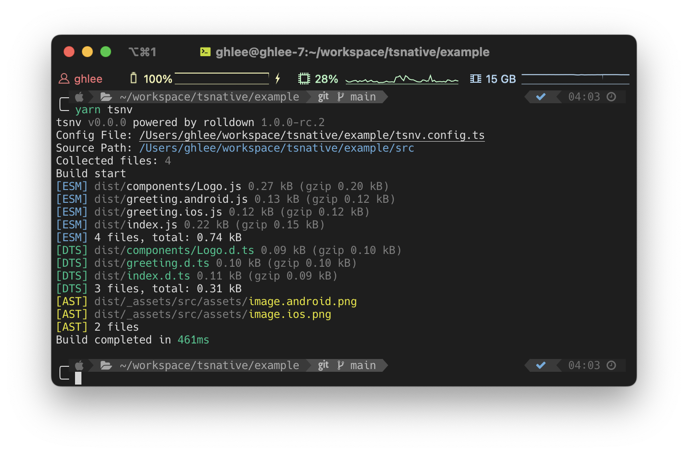

<div align="center">

# tsnv



Modern build toolkit for React Native libraries<br>
(powered by [Rolldown](https://rolldown.rs))

</div>

> [!NOTE]
> This project is under development

## Features

- **Fast** - Powered by [Rolldown](https://rolldown.rs), a Rust-based bundler
- **Platform-aware** - Automatic handling of platform-specific modules (`.android.ts`, `.ios.ts`, `.native.ts`)
- **Assets** - Built-in support for assets (images, fonts, and other static files)
- **TypeScript** - First-class TypeScript support with automatic `.d.ts` generation
- **Zero-config** - Sensible defaults that just work
- **Yarn PnP** - Works seamlessly with Yarn Plug'n'Play

## Installation

```bash
# npm
npm i -D tsnv

# pnpm
pnpm add -D tsnv

# yarn
yarn add -D tsnv
```

## Quick Start

Just run:

```bash
npx tsnv
```

That's it. tsnv works out of the box with sensible defaults:

- Source directory: `src`
- Output directory: `dist`
- TypeScript declarations: enabled

### Custom Configuration (Optional)

If you need to customize the build, create a `tsnv.config.ts`:

```ts
import { defineConfig } from 'tsnv';

export default defineConfig({
  sourcemap: true,
});
```

## Configuration

All configuration options with their default values:

```ts
import { defineConfig } from 'tsnv';

export default defineConfig({
  // Source directory
  source: 'src',

  // Output directory
  outDir: 'dist',

  // Generate TypeScript declaration files
  dts: true,

  // Platform specifiers for module resolution
  specifiers: ['android', 'ios', 'native'],

  // Source file extensions
  sourceExtensions: ['ts', 'tsx', 'js', 'jsx', 'json'],

  // Asset file extensions (Metro defaults)
  assetExtensions: ['bmp', 'gif', 'jpg', 'jpeg', 'png', 'psd', 'svg', 'webp' /* ... */],

  // The directory where asset files will be written.
  assetsDir: '_assets',

  // Files to exclude from the build
  exclude: /__(?:tests?|fixtures?|mocks?)__/,

  // Generate source maps
  sourcemap: false,

  // Clean output directory before build
  clean: true,

  // Code injection options
  banner: undefined,
  footer: undefined,
  intro: undefined,
  outro: undefined,

  // Experimental options
  experimental: {
    tsgo: false, // Use tsgo compiler
  },
});
```

## Output Structure

```
dist/
│   # JavaScript
├── index.js
├── greeting.android.js
├── greeting.ios.js
│  
│   # Types
├── index.d.ts
├── greeting.d.ts
│
│   # Assets
└── _assets/
      └── (files)
```

## License

[MIT](./LICENSE)
